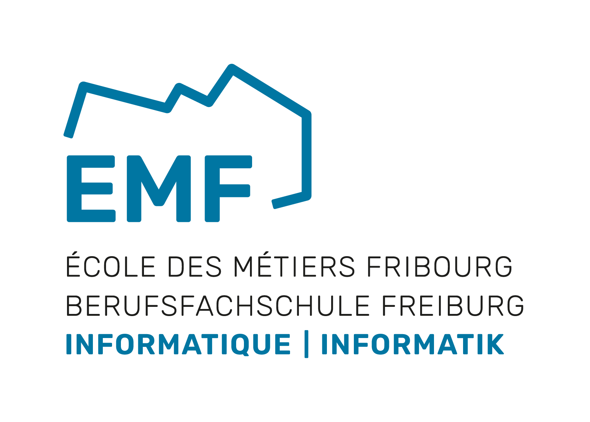

<h1>Module 323 - Programmer de manière fonctionnelle</h1>

# 👍 RP / `Cheat-sheet` perso 🍒

>[!TIP]
>Pour avancer de manière adéquate dans ces exercices et ces apprentissages avec la programmation fonctionnelle, un bon résumé personnel vous sera très utile !!
>
>Ce résumé vous facilitera la réalisation des exercices et vous permettra de progresser plus facilement avec l'utilisation de ces outils javascript de programmation fonctionnelle.
>
>Et dans le doute 🤔, en farfouillant dans les possibilités offertes, vous y trouverez peut-être un indice sur le comment résoudre tel ou tel besoin.

## 🎁 Cadeau

Vous trouverez ici mon propre [**pense-bête en PDF**](323-Cheat-Sheet-Paul-Friedli.pdf) que j'ai fait pour moi-même (Paul Friedli) et que je vous partage.

>[!WARNING]
Sentez-vous libre de vous en inspirer afin de produire le votre, personnalisé, plus complet, ... mais surtout **de vous approprier de son contenu ⚠️** afin que votre RP devienne votre et devienne utile !

---

